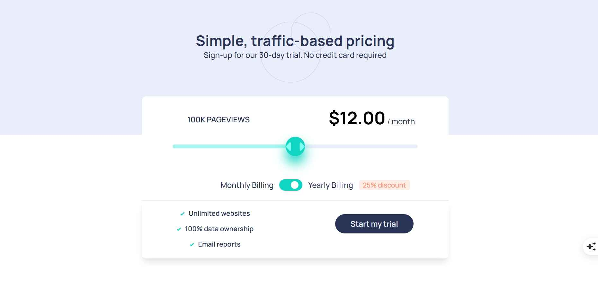

# Frontend Mentor - Interactive pricing component solution

This is a solution to the [Interactive pricing component challenge on Frontend Mentor](https://www.frontendmentor.io/challenges/interactive-pricing-component-t0m8PIyY8). Frontend Mentor challenges help you improve your coding skills by building realistic projects. 

## Table of contents

- [Overview](#overview)
  - [The challenge](#the-challenge)
  - [Screenshot](#screenshot)
  - [Links](#links)
- [My process](#my-process)
  - [Built with](#built-with)
  - [What I learned](#what-i-learned)
  - [Continued development](#continued-development)
  - [Useful resources](#useful-resources)
- [Author](#author)


## Overview

### The challenge

Users should be able to:

- View the optimal layout for the app depending on their device's screen size
- See hover states for all interactive elements on the page
- Use the slider and toggle to see prices for different page view numbers

### Screenshot




### Links

- Solution URL: [Add solution URL here](https://your-solution-url.com)
- Live Site URL: [Live site URL](https://ot-charlie.github.io/Interactive-Pricing-Component/)

## My process

### Built with

- Semantic HTML5 markup
- CSS custom properties
- Flexbox
- CSS Grid
- Mobile-first workflow
- [React](https://reactjs.org/) - JS library
- [Vite](https://vitejs.dev/) - Build tool
- [Tailwind CSS](https://tailwindcss.com/) - For styling


### What I learned

This project was my first deep dive into React, and I learned several fundamental concepts:

**1. State Management with useState**

I learned how to manage component state to create interactive features. The slider and toggle both use state to track user interactions:
```js
const [sliderValue, setSliderValue] = useState(2); // Track slider position
const [isYearly, setIsYearly] = useState(false);   // Track billing toggle
```

**2. Event Handling**

Understanding how to handle user interactions and update state accordingly:
```js
<input 
  type="range" 
  value={sliderValue}
  onChange={(e) => setSliderValue(Number(e.target.value))}
/>
```

**3. Computed Values and Conditional Rendering**

Learning to derive values from state and conditionally render content:
```js
const currentTier = pricingTiers[sliderValue];
const finalPrice = isYearly ? currentTier.price * 0.75 : currentTier.price;
```

This allowed the pricing to update dynamically based on both the slider position and billing toggle.

**4. Custom CSS for Range Input Styling**

Styling the custom slider was challenging but rewarding. I learned how to:
- Use CSS custom properties (variables) with React
- Style webkit and mozilla slider thumbs differently
- Create dynamic gradient fills based on slider position
```css
.custom-slider {
  background: linear-gradient(
    to right,
    hsl(174, 77%, 80%) var(--slider-progress),
    hsl(224, 65%, 95%) var(--slider-progress)
  );
}
```
```js
style={{ '--slider-progress': `${(sliderValue / 4) * 100}%` }}
```

**5. Responsive Design with Tailwind**

I learned Tailwind's mobile-first approach and how to use breakpoint prefixes:
```jsx

```

I also learned about the `order` utility for rearranging elements between mobile and desktop layouts without changing the HTML structure.

**6. Working with Assets in React**

Understanding the difference between importing assets in JavaScript vs. referencing them in CSS:
```js
// In component
import patternCircles from './assets/images/pattern-circles.svg'

// In CSS  
background-image: url('/src/assets/images/icon-slider.svg');
```


### Continued development


While this project covered React fundamentals, there are areas I want to explore further:

- **Component composition** - Breaking down larger components into smaller, reusable pieces
- **Props** - Passing data between components
- **React Hooks** - useEffect, useContext, and custom hooks
- **Form validation** - Handling user input validation
- **API integration** - Fetching and displaying data from external sources
- **Animation libraries** - Adding smooth transitions with Framer Motion or React Spring
- **Testing** - Writing tests for React components


### Useful resources

- [Claude (Anthropic)](https://claude.ai) - An AI assistant that guided me through learning React fundamentals, debugging issues, and understanding best practices. Invaluable for a beginner learning their first framework.
- [Tailwind CSS Documentation](https://tailwindcss.com/docs) - Excellent reference for utility classes and responsive design patterns.
- [MDN Web Docs - CSS](https://developer.mozilla.org/en-US/docs/Web/CSS) - Essential for understanding how to style custom form inputs.


## Author

- Website - [Onwuli Charles](https://onwuli-charles.netlify.app)
- Frontend Mentor - [Ot-charlie](https://www.frontendmentor.io/profile/Ot-charlie)
- Twitter - [Charl3s](https://www.twitter.com/kingcharlie01)


